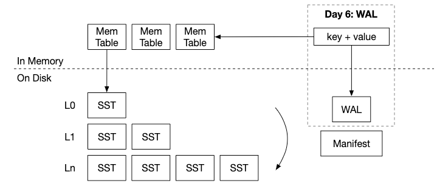

# Chapter Write-Ahead Log (WAL)

Contents
- implement the WAL
- implement recovery procedure

> from https://skyzh.github.io/mini-lsm/



Manifest file helps LSM state to be persistent as an atomic operation. WAL helps recover the memtable to memory after a database crash. The changes that were in the memtables before the crash but not yet persisted to durable storage are persisted to the WAL. This recovery functionality is similar to in a relational database where changes to the B-Trees are also written to the WAL (also called transaction log).

Firstly, we want WAL to be a feature which can be toggled. Hence, we add an option `wal_enabled` to config options.

```rust
struct DbOptions {
    // other configs...
    
    /// If set to false, WAL is disabled and db writes directly to memtable
    pub wal_enabled: bool,
}
```

### Wal implementation

We add some test cases for how we expect our Wal to behave first.
1. Empty WAL: Test creating a new WAL, writing no data, and ensuring it can be recovered into an empty SkipMap.○
2. Single Entry: Test writing a single key-value pair and recovering it.○
3. Multiple Entries: Test writing multiple key-value pairs and recovering them.○
4. Checksum Validation: Introduce deliberate corruption in the WAL file and ensure your recovery mechanism detects it.○
5. Partial Writes: Simulate scenarios where a write to the WAL file might be interrupted (e.g., due to a crash). Test if the recovery can handle such cases.
 
```rust
use std::sync::Arc;

use bytes::Bytes;
use crossbeam_skiplist::SkipMap;
use object_store::memory::InMemory;
use object_store::ObjectStore;

#[cfg(test)]
mod tests {
    #[tokio::test]
    async fn test_empty_wal() {
        // Use the in-memory object store for testing
        let object_store = Arc::new(InMemory::new());
        let wal_path = Path::from("test_empty_wal");
        // Create a new WAL at the given path.
        let wal = Wal::create(wal_path.clone(), object_store)
            .await
            .unwrap();

        // Recover the WAL into a SkipMap.
        let skiplist: SkipMap<Bytes, Bytes> = wal.recover().await.unwrap();
        // Assert that the SkipMap is empty.
        assert!(skiplist.is_empty());
    }

    #[tokio::test]
    async fn test_wal_single_entry() {
        let object_store = Arc::new(InMemory::new());
        let wal_path = Path::from("test_wal_single_entry");
        let wal = Wal::create(wal_path.clone(), object_store)
            .await
            .unwrap();

        wal.put(b"test_key", b"test_value").await.unwrap();
        let skiplist = wal.recover().await.unwrap();
        assert_eq!(
            skiplist.get(b"test_key").unwrap().value(),
            b"test_value"
        );
    }

    #[tokio::test]
    async fn test_wal_multiple_entries() {
        let object_store = Arc::new(InMemory::new());
        let wal_path = Path::from("test_wal_multiple_entries");
        let wal = Wal::create(wal_path, object_store)
            .await
            .unwrap();

        wal.put(b"key1", b"value1").await.unwrap();
        wal.put(b"key2", b"value2").await.unwrap();
        wal.put(b"key3", b"value3").await.unwrap();

        let skiplist = wal.recover().await.unwrap();
        assert_eq!(
            skiplist.get(b"key1").unwrap().value(),
            b"value1"
        );
        assert_eq!(
            skiplist.get(b"key2").unwrap().value(),
            b"value2"
        );
        assert_eq!(
            skiplist.get(b"key3").unwrap().value(),
            b"value3"
        );
    }
}
```

Wal encoding is simple a list of key-value pairs.
``` 
| key_len | key | value_len | value | key_len | key | value_len | value | ...
```

we start with a struct `Wal`. In our system, the WAL can be modified by different threads so we need
- `Arc` for multiple ownership of the buffer writer across multiple threads
- `Mutex` ensures that only one thread can mutate the WAL at a time to avoid race condition and data corruption.

Using `BufWriter` can reduce number of syscalls into the OS and also to reduce the latency of the write path. The trade-off is that data can be lost if there is a crash between flushing where the WAL is not persisted yet.

```rust
// wal.rs

pub struct Wal {
    file: Arc<Mutex<BufferWriter<File>>>,
}
```

The methods that we need
```rust
impl Wal {
    pub fn create(path: impl AsRef<Path>) -> Result<Self> {
        todo!()
    }


    pub fn recover(path: impl AsRef<Path>, skiplist: &SkipMap<Bytes, Bytes>) -> Result<Self> {
        todo!()
    }

    pub fn put(&self, key: &[u8], value: &[u8]) -> Result<()> {
        todo!()
    }

    pub fn put_batch(&self, data: &[(&[u8], &[u8])]) -> Result<()> {
        todo!()
    }

    pub fn sync(&self) -> Result<()> {
        todo!()
    }
}
```

#### implement put

```rust
impl Wal {
    // other methods
    pub fn put(&self, key: &[u8], value: &[u8]) -> Result<()> {
        let mut file = self.file.lock();
    }
}
```

### Adding WAL to memtable

MemTable has a WAL field. If the wal field is set to `Some(wal)`, we will need to append to the WAL when updating the memtable. In the LSM engine, we will need to create WALs if `wal_enabled = true`. 


We also need update the manifest using the ManifestRecord::NewMemtable record when new memtable is created.

### Recover from WAL

When starting the database, we need to read from WAL if enabled to make sure we recover the latest information from WAL to memtables. This modification is added in the storage engine class.

```rust
impl LSMStorage {
    pub fn open(path: Path, options: DBOpions) {
        // other code...
        if options.wal_enabled {
            let mut wal_cnt = 0;
            for id in memtables.iter() {
                let memtable = MemTable::recover_from_wal()?;
                if !memtable.is_empty() {
                    state.imm_memtables.insert(0, Ard::new(memtable));
                    wal_cnt += 1;
                }
            }
            println!("{} WALs recovered", wal_cnt);
            // create the newest memtable where write goes in
            state.memtable = Arc::new(MemTable::create_with_wal(
                next_sst_id,
                Self::path_of_wal_static(path, next_sst_id),
            )?);
        } else {
            state.memtable = Arc::new(MemTable::create(next_sst_id));
        }
    }
}
```

## References
- https://adambcomer.com/blog/simple-database/wal/
- https://medium.com/@dwivedi.ankit21/lsm-trees-the-go-to-data-structure-for-databases-search-engines-and-more-c3a48fa469d2
- https://github.com/facebook/rocksdb/wiki/Write-Ahead-Log-(WAL)

