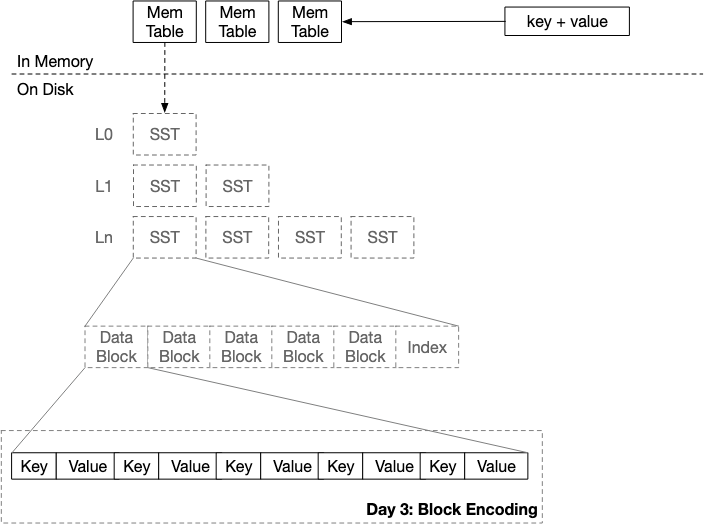

# Block

> image from https://skyzh.github.io/mini-lsm/




A block is a fundamental unit of data organization and storage in SSTable storage engine. It is equivalent to a page in BTree storage engine most-commonly used in relational databases. A SSTable contains multiple blocks which is usually sorted by key.

A block typically contains multiple key-value pairs, has a fixed size for example 4KB, 16KB, 64KB. It includes metadata like offsets for key lookup inside the block.

We start with some tests to understand what the expected API is and how blocks behave.

```rust
// in block.rs
#[cfg(test)]
mod tests {
    use std::io::Bytes;

    #[test]
    fn test_block() {
        // create new block with block size 4096 bytes
        let block = Block::new(4096);
        let encoded: Bytes = block.encode();
        let decoded: Block = Block::decode(encoded);
        assert_eq!(block.data, decoded.data);
        assert_eq!(block.offsets, decoded.offsets);
    }
}
```

### Block key-value offsets

```rust
pub struct Block {
    pub data: Bytes,
    /// offsets help fast access to a specific key-value pair in the block
    pub offsets: Vec<u16>,
}
```

Think of offsets as an index for our key-value pairs. Each entry in this vector corresponds to the starting position of a key-value pair within the block's data buffer. This design serves several important purposes:
1. Rapid Key Lookup: Instead of sequentially scanning through the entire block data, we can perform efficient binary searches on these offsets. This is particularly valuable when dealing with large blocks.
2. Variable-Length Support: Key-value pairs often vary in size. Our offset system elegantly handles this variability, allowing for flexible data storage without sacrificing access speed.
3. Compact Representation: Using `u16`allows indexing for blocks up to 64KB, suitable for most use cases. `TODO investigate what are the block sizes other database engines like RocksDB use`.
4. Encoding Efficiency: During the block encoding process, these offsets are appended after the main data, creating a self-contained, easily navigable data structure.

In the world of storage engines, every microsecond counts. The offsets field is our secret weapon in the quest for lightning-fast data retrieval. In the next section, we'll dive into implementing binary search using these offsets.
