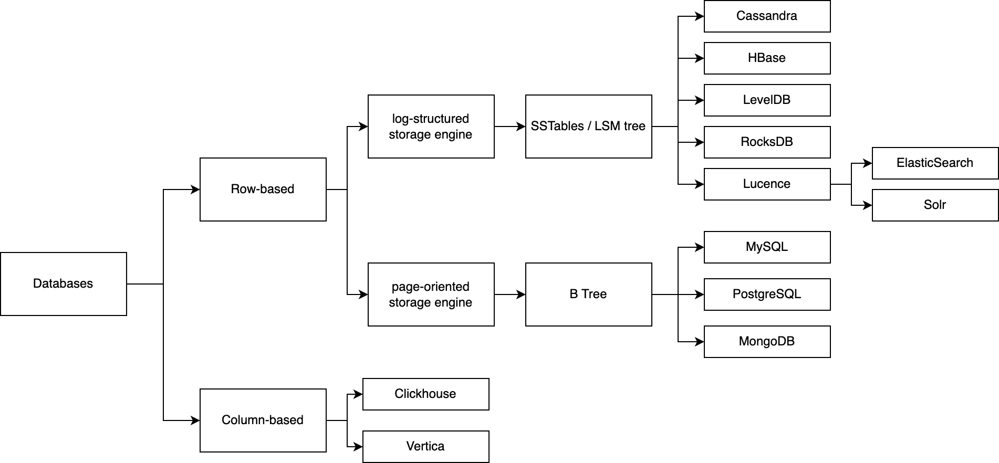

# Chapter 1 Overview

## Databases landscape

In this book, we are going to write a row-based key-value database using log-structure storage engine. The engine will be implemented using Sorted String Tables (SSTables) and Log-Structured Merge (LSM) tree on object storage like AWS S3.

## Key value database

Three main components of a key-value databases are
1. memtable
2. sorted-string table
3. WAL (write-ahead log) file

`memtable` is an in-memory data structure that serves reads and writes. New writes go to the wal for persistence. The WAL is regularly sends to object storage for durability.

## The simplest storage engine

TODO
- implement the simple storage engine of book DDIA using append-only text file
- where are the weak spots
- how to address those weak spots by using SSTables and LSM tree storage engine

## References
- [Design Data Intensive Applications](https://www.amazon.com/Designing-Data-Intensive-Applications-Reliable-Maintainable/dp/1449373321)
- https://skyzh.github.io/mini-lsm

