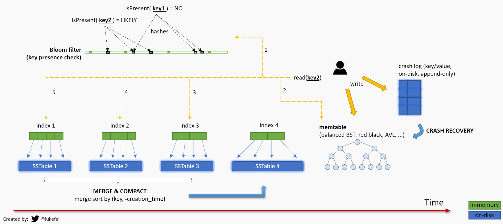

# Chapter 3 Sorted String Table



## Sorted String Table

Sorted Strings Table (SSTable) is a file format commonly used by NoSQL databases to store the data flushed by in-memory memtables to durable storage. It can be generally understood as a serialization format for the memtables. The memtables serialize the data when flushing and deserialize the binary back to memory structures.

### Log-Structure Merge Tree

An SSTable uses a Log-Structured Merge (LSM) tree data structure format. This format is more efficient for write-heavy, extremely large data sets than a traditional B-tree (pronounced “Bee tree”) format which commonly used in relational databases.

### Reading from SSTable and bloom filter

Bloom filter is used to avoid unnecessary disk I/O. Instead of reading the whole SSTable to memory, we check the bloom filter first to see if the key exists, if not we return immediately.

Bloom filter is a memory-efficient, probabilistic data structure that can give us an exact no answer and an approximate yes answer to whether an element is in a set.

```rust
impl SSTable {
    // other methods
    fn get(&self, key: &[u8]) -> Option<LSMEntry> {
        // return immediate to avoid disk IO if the key not in bloom filter
        if !self.bloom_filter.test(key) {
            return None
        }
    }
}
```

## References
- https://www.scylladb.com/glossary/sstable/
- https://jyotinder.substack.com/p/building-a-write-optimized-database-part-3
