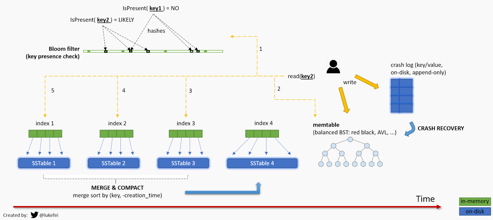

# Chapter 3 Storage Engine

Contents
- How is storage engine implemented with SSTable and LSM tree

> a nice overview picture taken from https://kflu.github.io/2018/02/09/2018-02-09-lsm-tree/



Quoting this good piece from [David Archuleta Jr.'s Blog - LSM Trees, Memtables & Sorted String Tables: An Introduction:](https://www.darchuletajr.com/blog/lsm-trees-memtables-sorted-string-tables-introduction)

> The on-disk component of the LSM Tree is the Sorted String Table. In order to write the contents of a sorted data structure, whether a tree, skip list, vector, or any other data structure, you just need to iterate in order from the lowest value to the highest. So it is a very simple and straightforward linear operation.

## Sorted String Table

The bad thing about just appending data to log file is that it is going to be slow as the database grows. Each time we want to look for a key, we need to traverse the entire data segment file to look for out key.

One novel idea to improve that is to `sort the data in each segment by key`. Actually this idea is not so novel as it is already widely known in Computer Science for a long time and is used in various data structure for example sorting and searching (binary search specifically). Sorting the keys can help us reduce the time complexity from O(n) to only O(log n). We call this new idea implementation **Sorted String Tables**.

Sorted Strings Table (SSTable) is a file format commonly used by NoSQL databases to store the data flushed by in-memory memtables to durable storage. It can be generally understood as a serialization format for the memtables. The memtables serialize the data when flushing and deserialize the binary back to memory structures.

### Log-Structure Merge Tree

An SSTable uses a Log-Structured Merge (LSM) tree data structure format. This format is more efficient for write-heavy, extremely large data sets than a traditional B-tree (pronounced “Bee tree”) format which commonly used in relational databases.

## Block

A block is a fundamental unit of data organization and storage in SSTable storage engine. It is equivalent to a page in BTree storage engine most-commonly used in relational databases. A SSTable contains multiple blocks which is usually sorted by key.

A block typically contains multiple key-value pairs, has a fixed size for example 4KB, 16KB, 64KB. It includes metadata like offsets for key lookup inside the block.

We start with some tests to understand what the expected API is and how blocks behave.

```rust
// in block.rs
#[cfg(test)]
mod tests {
    use std::io::Bytes;

    #[test]
    fn test_block() {
        // create new block with block size 4096 bytes
        let block = Block::new(4096);
        let encoded: Bytes = block.encode();
        let decoded: Block = Block::decode(encoded);
        assert_eq!(block.data, decoded.data);
        assert_eq!(block.offsets, decoded.offsets);
    }
}
```

### Block key-value offsets

```rust
pub struct Block {
    pub data: Bytes,
    /// offsets help fast access to a specific key-value pair in the block
    pub offsets: Vec<u16>,
}
```

Think of offsets as an index for our key-value pairs. Each entry in this vector corresponds to the starting position of a key-value pair within the block's data buffer. This design serves several important purposes:
1. Rapid Key Lookup: Instead of sequentially scanning through the entire block data, we can perform efficient binary searches on these offsets. This is particularly valuable when dealing with large blocks.
2. Variable-Length Support: Key-value pairs often vary in size. Our offset system elegantly handles this variability, allowing for flexible data storage without sacrificing access speed.
3. Compact Representation: Using `u16`allows indexing for blocks up to 64KB, suitable for most use cases. `TODO investigate what are the block sizes other database engines like RocksDB use`.
4. Encoding Efficiency: During the block encoding process, these offsets are appended after the main data, creating a self-contained, easily navigable data structure.

In the world of storage engines, every microsecond counts. The offsets field is our secret weapon in the quest for lightning-fast data retrieval. In the next section, we'll dive into implementing binary search using these offsets.

### Reading from SSTable and bloom filter

Bloom filter is used to avoid unnecessary disk I/O. Instead of reading the whole SSTable to memory, we check the bloom filter first to see if the key exists, if not we return immediately.

Bloom filter is a memory-efficient, probabilistic data structure that can give us an exact no answer and an approximate yes answer to whether an element is in a set.

```rust
impl SSTable {
    // other methods
    fn get(&self, key: &[u8]) -> Option<LSMEntry> {
        // return immediate to avoid disk IO if the key not in bloom filter
        if !self.bloom_filter.test(key) {
            return None
        }
    }
}
```

```rust
// bloom.rs
pub struct Bloom {
    filter: Bytes,
}

impl Bloom {
    pub fn test(&self, hash: u32) -> bool {
        
    }
}
```

Writing your own bloom filter is interesting. Here we delay it as an add-on item for later, now we are going to use an existing crate to understand the high-level building blocks of the database first.

## References
- https://www.scylladb.com/glossary/sstable/
- https://jyotinder.substack.com/p/building-a-write-optimized-database-part-3
- https://kflu.github.io/2018/02/09/2018-02-09-lsm-tree/
- 
