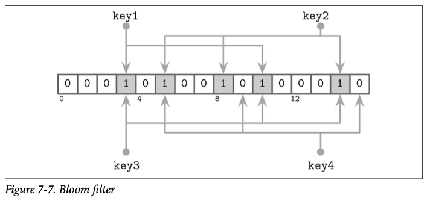

# Bloom Filter


Bloom filter is used to avoid unnecessary disk I/O. Instead of reading the whole SSTable to memory, we check the bloom filter first to see if the key exists, if not we return immediately.

A Bloom filter is a space-efficient probabilistic data structure used to test whether an element is a member of a set. It can tell us with certainty that an element is not in the set, but it may give false positives. This property makes Bloom filters particularly useful in LSM tree-based storage engines for optimizing read operations.

We store one Bloom filter per SSTable. This allows for removing many from our search without loading them from object storage into memory.

```rust
impl SSTable {
    // other methods
    fn get(&self, key: &[u8]) -> Option<LSMEntry> {
        // return immediate to avoid disk IO if the key not in bloom filter
        if !self.bloom_filter.test(key) {
            return None
        }
    }
}
```

```rust
// bloom.rs
pub struct Bloom {
    filter: Bytes,
}

impl Bloom {
    pub fn test(&self, hash: u32) -> bool {
        
    }
}
```

Writing your own bloom filter is interesting. Here we delay it as an add-on item for later, now we are going to use an existing crate to understand the high-level building blocks of the database first.


### An example of Bloom Filter

> Source: Database Internals



A Bloom filter consists of a bit array of m bits, initially all set to 0, and k different hash functions. 

To add an element:
1. Feed it to each of the k hash functions to get k array positions.
2. Set the bits at all these positions to 1.

To query for an element:
1. Feed it to each of the k hash functions to get k array positions. 
2. If any of the bits at these positions is 0, the element is definitely not in the set.
3. If all are 1, then either the element is in the set, or we have a false positive.

## References
- Database Internals. Book.